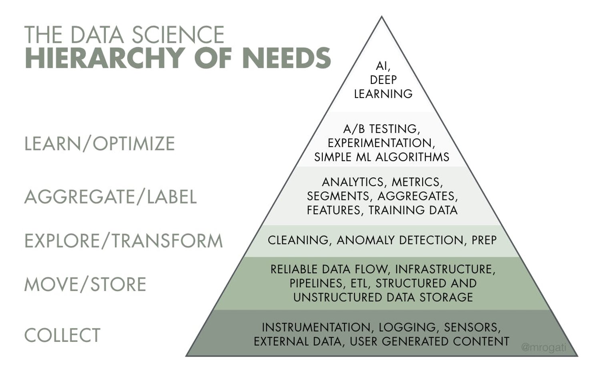
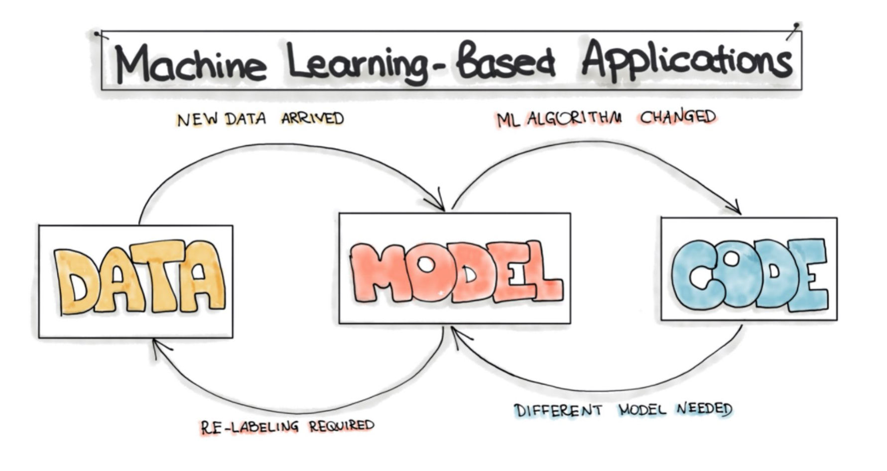

# Contexto

## Ciencia de Datos

> Ciencia de Datos es el estudio de extraer valor de los datos. Valor que puede ser en forma de insights (nuevas perspectivas) o conclusiones.

*[Data Science in Context: Foundations, Challenges, Opportunities.](https://datascienceincontext.com/)*

{ width="600" }

*[The AI Hierarchy of Needs (Mónica Rogati, Hackernoon)​](https://hackernoon.com/the-ai-hierarchy-of-needs-18f111fcc007)*

> La triste realidad es que la mayoría de los proyectos de IA fracasan. Según una investigación de Gartner, solo el 15% de las soluciones de IA implementadas para 2022 serán exitosas, y serán muchas menos las que crearán un valor positivo en términos de ROI.

*[Why most AI implementations fail, and what enterprises can do to beat the odds​.](https://venturebeat.com/ai/why-most-ai-implementations-fail-and-what-enterprises-can-do-to-beat-the-odds/)*

{ width="600" }

*[MLOps: Why you Might Want to use Machine Learning](https://ml-ops.org/content/motivation)*