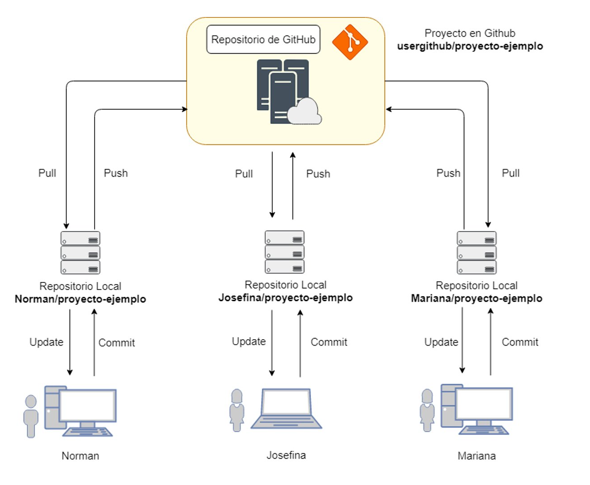
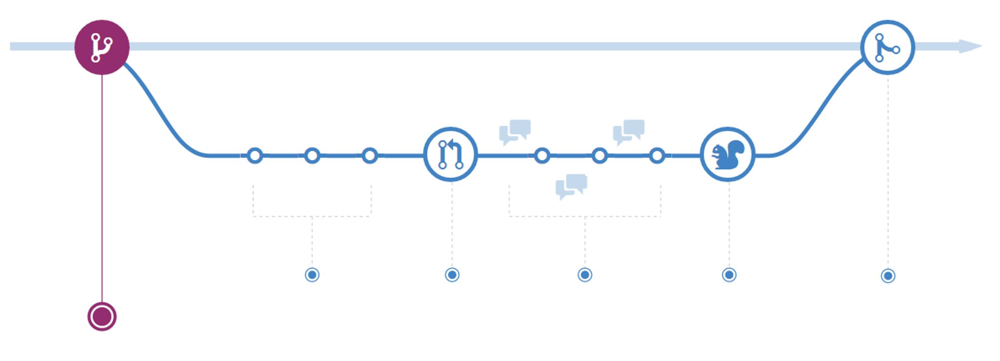
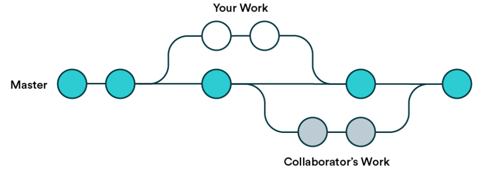

# Git

Aprenderemos Github usando este [Template](https://github.com/aastroza/introduccion-a-github). Hay que abrir este enlace y seguir las instrucciones.

>Git es un software de control de versiones diseñado por Linus Torvalds, pensando en la eficiencia, la confiabilidad y compatibilidad del mantenimiento de versiones de aplicaciones cuando estas tienen un gran número de archivos de código fuente. Su propósito es llevar registro de los cambios en archivos de computadora incluyendo coordinar el trabajo que varias personas realizan sobre archivos compartidos en un repositorio de código.

*[Git en Wikipedia](https://es.wikipedia.org/wiki/Git)*

{ width="600" }

*[Norman Perrin, Introducción a Git y Github](https://github.com/NormanPerrin/introduccion-a-git-y-github)*

{ width="600" }

*[Understanding the GitHub flow](https://docs.github.com/en/get-started/quickstart/github-flow)*

## Por qué es importante


Usar un software de control de versiones es invaluable para gestionar experimentos computacionales por tres razones:[^1]

[^1]: Noble WS (2009) A Quick Guide to Organizing Computational Biology Projects. PLOS Computational Biology 5(7): e1000424. https://doi.org/10.1371/journal.pcbi.1000424

- **Proporciona una forma de respaldo**. 

- **Proporciona un registro histórico** que puede ser útil para rastrear errores o entender resultados antiguos. Típicamente, un script o programa evolucionará a lo largo del curso de un proyecto. En lugar de almacenar muchas copias del script con nombres ligeramente diferentes, se confía en el sistema de control de versiones para llevar un seguimiento de esas versiones. Si se necesita reproducir exactamente un experimento que se realizó hace tres meses, se puede usar el control de versiones para obtener una copia del estado del proyecto en ese momento.

- **Es invaluable para proyectos colaborativos**. El repositorio permite que los colaboradores trabajen simultáneamente en una colección de archivos, incluidos scripts, documentación o un borrador de manuscrito.

## Consejos

Algunos tips de [Git for Data Science](https://valohai.com/blog/git-for-data-science/):

### No agregues los datasets

Git es un sistema de control de versiones diseñado para servir a los desarrolladores de software. Cuenta con excelentes herramientas para manejar el código fuente y otros contenidos relacionados como configuración, dependencias, documentación. No está pensado para datos de entrenamiento. Punto. Git es solo para código.

En el desarrollo de software, el código es rey y todo lo demás sirve al código. En la ciencia de datos, esto ya no es el caso y existe una dualidad entre datos y código. No tiene sentido que el código dependa de los datos tanto como no tiene sentido que los datos dependan del código. Deben estar desacoplados y aquí es donde el modelo de desarrollo de software centrado en el código te falla. Git no debería ser el punto central de verdad para un proyecto de ciencia de datos.

Hay extensiones como LFS que se refieren a conjuntos de datos externos desde un repositorio git. Aunque cumplen un propósito y resuelven algunos de los límites técnicos (tamaño, velocidad), no resuelven el problema central de una mentalidad de desarrollo de software centrada en el código arraigada en git.

Siempre tendrás conjuntos de datos flotando en tu directorio local, sin embargo. Es bastante fácil agregarlos accidentalmente al escenario y hacer un commit de ellos si no tienes cuidado. La forma correcta de asegurarte de que no necesitas preocuparte por los conjuntos de datos con git es usar el archivo de configuración .gitignore. Agrega tus conjuntos de datos o la carpeta de datos a la configuración y no mires atrás.

Ejemplo:

```
# ignore archives
*.zip
*.tar
*.tar.gz
*.rar

# ignore dataset folder and subfolders
data/
```

### No agregues tus passwords/keys

Esto debería ser obvio, pero los constantes errores en el mundo real nos demuestran que no lo es. No importa si el repositorio es privado. En ninguna circunstancia se debe hacer un commit de ningún nombre de usuario, contraseña, token de API, código clave, certificados TLS, o cualquier otro dato sensible en git.

Incluso los repositorios privados son accesibles por múltiples cuentas y también se clonan en múltiples máquinas locales. Esto le da al hipotético atacante exponencialmente más objetivos. Recuerda que los repositorios privados también pueden volverse públicos en algún momento.

Desacopla tus secretos de tu código y pásalos usando el entorno en su lugar. Para Python, puedes usar el común archivo .env, que contiene las variables de entorno, y el archivo .gitignore, que asegura que el archivo .env no se envíe al repositorio remoto de git. Es una buena idea también proporcionar el .env.template para que otros sepan qué tipo de variables de entorno espera el sistema.

**.env:**

`API_TOKEN=98789fsda789a89sdafsa9f87sda98f7sda89f7`

**.env.template:**

`API_TOKEN=`

**.gitignore:**

```
.env
```

**hello.py:**

```python
from dotenv import load_dotenv
load_dotenv()
api_token = os.getenv('API_TOKEN')
```

Esto todavía requiere algo de copiar y pegar manualmente para cualquiera que clone el repositorio por primera vez. Para una configuración más avanzada, hay herramientas encriptadas y con acceso restringido que pueden compartir secretos a través del entorno, como [Doppler](https://www.doppler.com/)

!!! note

    Si ya has enviado tus secretos al repositorio remoto, no intentes arreglar la situación simplemente borrándolos. Es demasiado tarde ya que git está diseñado para ser inmutable. Una vez que el gato está fuera de la bolsa, la única estrategia válida es cambiar las contraseñas o desactivar los tokens.

### Realiza commits pequeños con descripciones claras

Los usuarios inexpertos a menudo caen en la trampa de hacer commits enormes con descripciones sin sentido. Una buena regla general para cualquier commit en git es que solo debe hacer una cosa. Arreglar un bug, no tres. Resolver un problema, no doce. Recuerda que los problemas a menudo pueden dividirse en partes más pequeñas también. Cuanto más pequeño puedas hacerlo, mejor.

La razón por la que usas el control de versiones es para que otra persona pueda entender lo que ha sucedido en el pasado. Si tu commit arregla doce bugs y la descripción dice "Modelo arreglado", su valor es cercano a cero dos meses después. El commit solo debe hacer una cosa y solo una cosa. La descripción debe comunicar lo que esa cosa fue. No necesitas hacer descripciones extensas si los commits son pequeños. De hecho, ¡una descripción larga para un mensaje de commit implica que el commit es demasiado grande y deberías dividirlo en partes más pequeñas!

**Ejemplo de un mal repositorio**


**Ejemplo de un buen repositorio**


### No le tengas miedo a las ramas y pull requests

El uso de ramas y, en especial, de pull requests son técnicas ligeramente más avanzadas y no son del agrado de todos, pero si tu proyecto de ciencia de datos está maduro, en producción y constantemente manejado por muchas personas diferentes, los pull requests podrían ser justo lo que falta en tu proceso.

Cuando creas un nuevo repositorio git, este comienza con una única rama llamada main (o master). La rama main se considera como la *verdad central*. Crear ramas significa que te desviarás temporalmente para crear una nueva característica o una corrección a una antigua. Mientras tanto, alguien más puede trabajar en paralelo en su propia rama. Esto se conoce comúnmente como flujo de trabajo de rama de características.

{ width="600" }

*[Git for Data Science](https://valohai.com/blog/git-for-data-science/)*

La idea con las ramas es eventualmente fusionarse de nuevo a la rama main y actualizar *la verdad central*. Aquí es donde entran en juego los pull requests. Al resto del mundo no le importan tus commits en tu propia rama, pero fusionarse a main es cuando tu rama se convierte en la última verdad. Ese es el momento de hacer un pull request.

Los pull requests no son un concepto de git, sino de GitHub. Son una solicitud para hacer de tu rama la nueva verdad central. Mediante el pull request, otros usuarios revisarán tus cambios antes de que se les permita convertirse en la nueva verdad central. GitHub ofrece excelentes herramientas para hacer comentarios, sugerir modificaciones, señalar aprobaciones y finalmente aplicar la fusión automáticamente.

### [Opcional] No agregues los outputs de los Jupyter Notebooks

Los notebooks son geniales porque te permiten no solo almacenar código, sino también los resultados de las celdas, como imágenes, gráficos y tablas. El problema surge cuando haces commit y push del notebook con sus salidas a git.

La forma en que los notebooks serializan todas las imágenes, gráficos y tablas no es atractiva. En lugar de archivos separados, codifica todo como sintaxis JSON en el archivo .ipynb. Esto confunde a git.

Git piensa que la sintaxis JSON son igual de importantes que tu código. Las tres líneas de código que cambiaste se mezclan con las tres mil líneas que se cambiaron en la sintaxis JSON. Intentar comparar las dos versiones se vuelve inútil debido a todo el ruido adicional.


*[ReviewNB Blog](https://blog.reviewnb.com/jupyter-version-control/)*

Se vuelve aún más confuso si hemos cambiado algo de código después de que se generaron las salidas. Ahora el código y las salidas que están almacenadas en el control de versiones ya no coinciden.

Hay dos opciones a nuestra disposición:

- Puedes borrar manualmente las salidas desde el menú principal (Celdas -> Toda la Salida -> Borrar) antes de crear tu commit en git.
- Puedes configurar un hook de pre-commit para git que borre las salidas automáticamente.

Trataremos de implementar esta opción #2, ya que los pasos manuales que necesitas recordar están destinados a fallar eventualmente.